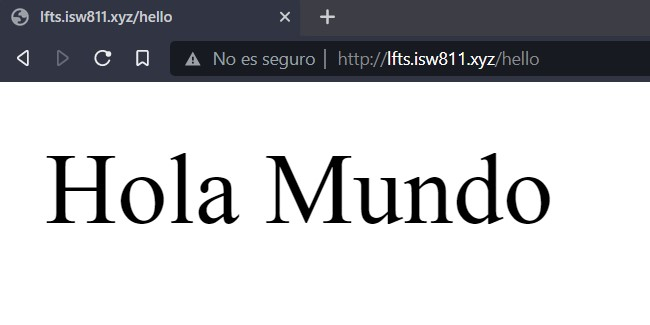

# Primera Lección

## ¿Que son rutas?

    - Las rutas es donde se establece cual URL de nuestra aplicación va a servir cual recurso HTML de nuestra aplicación

## ¿Cómo funcionan las rutas?

Las rutas las podemos encontrar en la carpeta `/resources/routes ` y se ven así

```
   Route::get('/', function () { return view('welcome'); });

```

Están compuestas por

1. Un verbo HTTP (GET/POST)
2. Un PATH o Ruta
3. Un recurso que va a ser servido

Como se ve, por defecto en la ruta **"/"** se sirve la vista **Welcome.Blade.php**

El cual es un archivo HTML que se presenta cuando accedemos a la raíz de nuestro dominio
**"/"**

Tambien es posible, en vez de retornar una vista HTML el retornar codigo directamente como lo haremos a continuacion para la ruta **/hello**

```
   Route::get('/hello', function () { return "Hola Mundo" });

```

Lo cual se ve de la siguiente manera


